# Method Backbone

This repo defines a method workbench for enterprise modernization. It is the source of truth for the engagement sequence, structured artifacts, decision gates, and handoff contracts that a future webapp should implement.

## System Shape

The method has five layers:

1. Principles: the modernization philosophy and boundaries.
2. Process: Step 0 plus Steps 1-18, grouped into seven umbrellas.
3. Client touchpoints: batched moments for client input, validation, and approval.
4. Contracts: schemas, templates, rubrics, scoring logic, and halt rules.
5. Handoff: decision packets and lifecycle objects that define what a separately approved build phase may implement.

## Seven Umbrellas

1. Frame And Hypothesize: Steps 0-2.
2. Discover Reality: Steps 3-5.
3. Build And Validate The Intelligence Layer: Steps 6-8.
4. Define AI Reasoning Requirements: Steps 9-10.
5. Prove Measurement And Value: Steps 11-12.
6. Shape The Future Solution: Steps 13-15.
7. Decide And Govern: Steps 16-18.

## Client Touchpoint Architecture

The internal method still runs Step 0 through Step 18. The client-facing experience should be batched into five touchpoints so the operating partner does not return to the client after every step. This reduces client burden by packaging inputs and confirmations; it does not reduce workflow interviews, system/data discovery, truth-production mapping, governance validation, risk review, readiness scoring, or handoff rigor.

| Client bundle | Locks by | Purpose |
|---|---:|---|
| Strategy bundle | End Step 2 | Goals, scope, decision rights, constraints, candidate terrain, participant coverage, and success criteria. |
| Workflow interview bundle | End Step 4 | Role interviews, workflow variation, systems mentioned, edge cases, source paths, truth chains, and adoption signals. |
| Evidence/data bundle | Request at Step 5; resolve by Step 8 | One consolidated planning-evidence request and the approved artifacts, walkthroughs, schemas, screenshots, formulas, or substitutes needed for validation. |
| Governance validation bundle | End Step 8 | Source, truth-production, owner, steward, access, sensitivity, retention, and permitted/prohibited AI-action decisions. |
| Decision/handoff bundle | End Step 18 | Value, solution shape, adoption design, technical plan, risk controls, readiness, decision packet, lifecycle, and method-to-build handoff approval. |

After Step 8, the operating partner and AI should use the validated baseline to perform most Steps 9-18 work internally. Client participation should be targeted expert validation, IT/data/security feasibility confirmation, risk/control confirmation, and final approval rather than a new broad discovery cycle.

## Deployment Evidence Calibration

Successful enterprise AI deployment patterns reinforce the method's bias: the model is rarely the hardest part. The future app should help operators capture the invisible work that determines outcomes: active sponsor behavior, process redesign, process documentation, data access, knowledge capture, resistance by source, staff-function approvals, security enablement, measurement, model/orchestration posture, and lifecycle learning.

## Artifact Flow

```mermaid
flowchart LR
  A["Executive terrain and candidate use cases"] --> B["Interviews, variation, and evidence needs"]
  B --> C["Workflow intelligence object"]
  C --> D["Organizational intelligence diagnostic"]
  D --> E["Validated baseline"]
  E --> F["Knowledge, guidance, and eval requirements"]
  F --> G["Measurement and business value"]
  G --> H["Solution, technical, adoption, and risk design"]
  H --> I["Readiness object"]
  I --> J["Implementation decision packet"]
  J --> K["Managed lifecycle and handoff"]
```

## Operating Boundary

The method ends at an approved Step 18 handoff. Step 18 is the boundary; there is no additional numbered method step after it. A future build phase may then implement an app, agent, workflow automation, connector, MCP server, normalization pipeline, or integration only if the approved packet and lifecycle authorize it and a separate implementation approval starts that phase.

During the method engagement, the system may run offline proof points using approved redacted, synthetic, or historical examples. These proofs support evidence, guidance, evals, and readiness decisions. They are not production implementation.

Post-18 build/operate work is handled outside the Step 0-18 engagement sequence. The `agent-build-managed-agentops` skill consumes approved Step 17/18 handoff artifacts after separate implementation approval and produces build/operate contracts for implementation teams and Managed AgentOps owners.

## What The Future App Should Operationalize

The app should make the method repeatable:

- Guided step execution with explicit gates and loopbacks.
- Interview capture, evidence logging, and source traceability.
- Sponsor, resistance, prior-failure, and headcount/capacity outcome capture.
- Structured object editors for workflow intelligence, baselines, guidance packs, readiness objects, decision packets, and lifecycle objects.
- Validation workflows for sponsors, operators, data owners, technical owners, risk owners, and remediation owners.
- Scoring, comparison, disqualification, and halt/revisit workflows.
- Model abstraction, oversight-model, shadow AI, and security-enablement planning surfaces.
- Exportable packets and build-phase handoff packages.
- Post-18 contract generation from approved handoff artifacts after separate implementation approval, without representing build execution as a new method step.

## What Must Stay Stable

- The pre-build boundary.
- Evidence-linked object creation.
- Behavior-level readiness.
- Hard-gate readiness logic.
- Vertical-extension protocol.
- Step 17 packet contracts.
- Step 18 lifecycle and handoff contracts.

The app may improve ergonomics, collaboration, review, and reporting. It should not weaken those invariants.
