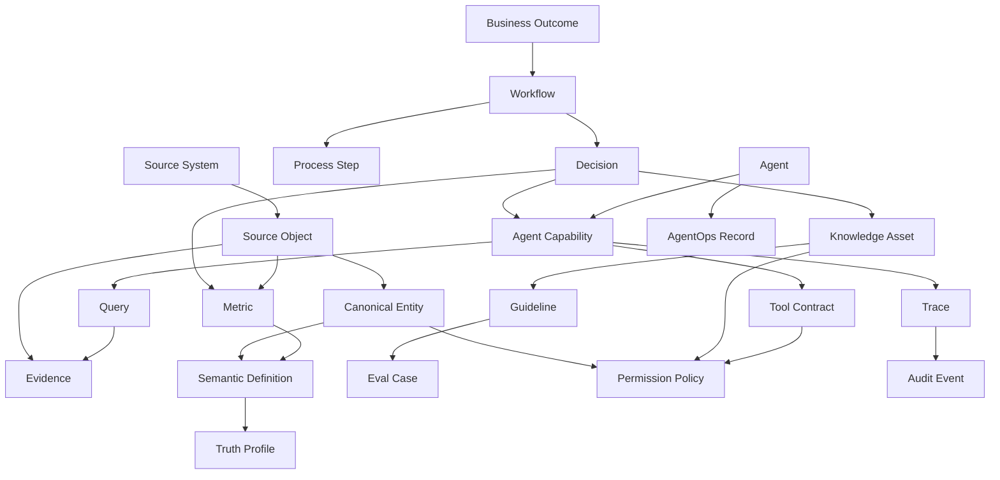

# Operating Intelligence Platform Ontology

Purpose: define the object model for the operating intelligence platform. This ontology is the conceptual and semantic layer that makes a company queryable and agent-ready.

Audience: platform architects, data architects, enterprise architects, AI engineers, product owners, data governance owners, and implementation teams.

Status: v0.1 starter ontology. Extend by domain and client after Section 1 evidence validates the actual workflow, data, knowledge, owners, and controls.

## What The Ontology Is

The ontology is the governed business object graph for the platform.

It defines:

- the important business objects.
- how objects relate to each other.
- which sources prove or update each object.
- who owns each object.
- which definitions and metrics apply.
- which users and agents can access or act on each object.
- which risks, controls, policies, and audit events govern each object.
- which agent capabilities can safely use each object.

The ontology is not just a database schema. It is the semantic contract between business workflows, data systems, documents, metrics, permissions, and AI agents.

## Core Design Rules

1. Start from business workflows and decisions, not tables.
2. Keep raw source data, canonical entities, semantic definitions, documents, tools, and agent actions logically separate.
3. Every important object must have provenance: source, owner, evidence, freshness, and confidence.
4. Every important metric must have a definition, formula, owner, lineage, and reconciliation rule.
5. Every agent action must be tied to a permissioned object, tool contract, approval model, trace, and revocation path.
6. The ontology must support metadata-only scaffolding before proprietary data is available.
7. The first version should model one workflow or domain deeply, not the whole enterprise shallowly.
8. Client-specific extensions must not break core object contracts.

## Top-Level Ontology Domains

The ontology has eight top-level domains:

1. Enterprise domain: organization, teams, roles, people, portfolios, properties, vendors, systems.
2. Workflow domain: workflows, steps, decisions, tasks, approvals, exceptions, handoffs.
3. Data and source domain: source systems, datasets, fields, source access profiles, canonical entities, mappings.
4. Semantic and truth domain: metrics, definitions, formulas, reconciliations, lineage, quality rules, truth profiles.
5. Knowledge domain: documents, policies, SOPs, examples, guidelines, tacit knowledge, expert rules.
6. Governance and security domain: permissions, data classification, policies, controls, risks, incidents, retention, audit.
7. Platform operations domain: queries, views, dashboards, evidence packets, refresh jobs, quality checks, observability.
8. Agent domain: agents, capabilities, tools, evals, guardrails, traces, releases, AgentOps records.

## Conceptual Graph



## Core Object Types

### Enterprise Objects

| Object | Purpose | Minimum Fields |
|---|---|---|
| `organization` | The client enterprise or legal group. | `organization_id`, `name`, `industry`, `owner`, `status` |
| `business_unit` | Operating unit, region, function, department, or subsidiary. | `business_unit_id`, `name`, `parent_org_id`, `leader`, `scope` |
| `team` | Group responsible for workflow execution or ownership. | `team_id`, `name`, `business_unit_id`, `owner`, `responsibilities` |
| `role` | Business, technical, data, security, support, or approval role. | `role_id`, `name`, `authority_scope`, `approval_rights` |
| `person_or_actor` | Human actor, service account, agent identity, vendor actor, or approver. | `actor_id`, `actor_type`, `name`, `roles`, `access_scope` |
| `system` | Application, platform, source system, repository, data warehouse, workflow tool. | `system_id`, `name`, `owner`, `vendor`, `environment`, `access_path` |
| `vendor` | External provider, manager, operator, technology vendor, or data provider. | `vendor_id`, `name`, `service_scope`, `data_access`, `contract_ref` |

### Workflow Objects

| Object | Purpose | Minimum Fields |
|---|---|---|
| `business_outcome` | The measurable result the platform supports. | `outcome_id`, `name`, `owner`, `metric_refs`, `value_hypothesis` |
| `workflow` | End-to-end work process. | `workflow_id`, `name`, `owner`, `scope`, `start_event`, `end_event` |
| `process_step` | One step in a workflow. | `step_id`, `workflow_id`, `name`, `actor_role`, `inputs`, `outputs` |
| `decision` | Human or system decision that depends on evidence. | `decision_id`, `workflow_id`, `decision_owner`, `criteria`, `evidence_required` |
| `task` | Unit of work assigned to a role, person, system, or agent. | `task_id`, `workflow_id`, `owner`, `status`, `due_date`, `evidence_refs` |
| `approval_gate` | Required approval point. | `gate_id`, `workflow_id`, `approver_role`, `criteria`, `audit_required` |
| `exception` | Known deviation, edge case, conflict, or escalation path. | `exception_id`, `workflow_id`, `condition`, `owner`, `resolution_path` |
| `handoff` | Transfer of work, data, responsibility, or decision authority. | `handoff_id`, `from_role`, `to_role`, `object_refs`, `acceptance_criteria` |

### Data And Source Objects

| Object | Purpose | Minimum Fields |
|---|---|---|
| `source_system` | System that contains authoritative or useful data. | `source_system_id`, `system_id`, `source_status`, `owner`, `access_path` |
| `source_object` | Table, view, report, export, API object, spreadsheet, document folder, dashboard, or file. | `source_object_id`, `source_system_id`, `name`, `object_type`, `owner` |
| `source_field` | Field, column, attribute, report value, or document metadata field. | `field_id`, `source_object_id`, `name`, `data_type`, `sensitivity` |
| `source_access_profile` | How the platform may access a source. | `profile_id`, `source_object_id`, `access_method`, `allowed_actions`, `blocked_actions` |
| `canonical_entity` | Governed business entity used by the platform. | `entity_id`, `entity_type`, `name`, `identity_rule`, `owner` |
| `canonical_attribute` | Governed attribute on a canonical entity. | `attribute_id`, `entity_type`, `name`, `definition_ref`, `source_mapping_refs` |
| `entity_crosswalk` | Maps source IDs to canonical IDs. | `crosswalk_id`, `canonical_entity_id`, `source_object_id`, `source_key`, `match_confidence` |
| `source_to_canonical_mapping` | Transformation from source fields to canonical attributes. | `mapping_id`, `source_field_refs`, `target_attribute`, `rule`, `owner` |
| `dataset` | Curated table, view, index, document set, or analytical object. | `dataset_id`, `name`, `grain`, `refresh_cadence`, `lineage_refs` |

### Semantic And Truth Objects

| Object | Purpose | Minimum Fields |
|---|---|---|
| `metric` | Governed KPI or measurable value. | `metric_id`, `name`, `definition_ref`, `formula_ref`, `owner`, `grain` |
| `definition` | Business definition of a term, field, metric, status, or entity. | `definition_id`, `term`, `definition`, `owner`, `approval_status` |
| `formula` | Calculation rule for a metric or derived value. | `formula_id`, `expression`, `input_refs`, `owner`, `version` |
| `truth_profile` | How a fact or metric is produced and trusted. | `truth_profile_id`, `object_ref`, `official_source`, `de_facto_source`, `truth_status` |
| `reconciliation_rule` | How conflicting sources are compared or resolved. | `rule_id`, `source_refs`, `priority_order`, `tolerance`, `owner` |
| `quality_rule` | Data quality expectation. | `quality_rule_id`, `object_ref`, `rule_type`, `threshold`, `owner`, `severity` |
| `lineage_edge` | Provenance link from source to derived object. | `lineage_id`, `from_object`, `to_object`, `transformation_ref`, `timestamp` |
| `freshness_rule` | Expected update timing and stale-data behavior. | `freshness_rule_id`, `object_ref`, `expected_lag`, `stale_behavior`, `owner` |

### Knowledge Objects

| Object | Purpose | Minimum Fields |
|---|---|---|
| `knowledge_asset` | Governed document, policy, SOP, example, memo, playbook, or expert note. | `knowledge_asset_id`, `title`, `asset_type`, `owner`, `source_ref` |
| `document` | Specific file, record, email, memo, lease, contract, report, or policy document. | `document_id`, `title`, `document_type`, `location`, `owner`, `sensitivity` |
| `guideline` | Rule or instruction used by humans or agents. | `guideline_id`, `applies_to`, `rule_text`, `source_refs`, `owner` |
| `example_case` | Good, bad, edge, or exception example. | `example_id`, `workflow_id`, `decision_ref`, `input_summary`, `expected_outcome` |
| `expert` | Person or role with tacit knowledge. | `expert_id`, `actor_id`, `knowledge_area`, `validation_status` |
| `knowledge_gap` | Missing, disputed, stale, or tacit-only knowledge. | `gap_id`, `knowledge_area`, `risk`, `owner`, `capture_route` |
| `citation` | Evidence link used in a query, answer, eval, or decision. | `citation_id`, `source_ref`, `excerpt_ref`, `access_policy_ref`, `timestamp` |

### Governance And Security Objects

| Object | Purpose | Minimum Fields |
|---|---|---|
| `data_classification` | Sensitivity and handling classification. | `classification_id`, `name`, `handling_rules`, `retention_rule_ref` |
| `permission_policy` | Access and action policy. | `policy_id`, `subject_ref`, `object_ref`, `allowed_actions`, `conditions` |
| `access_grant` | Actual permission assignment. | `grant_id`, `actor_id`, `policy_id`, `environment`, `expires_at` |
| `control` | Preventive, detective, corrective, approval, or revocation control. | `control_id`, `control_type`, `object_ref`, `owner`, `verification_method` |
| `risk` | Risk linked to data, workflow, tool, output, source, or agent. | `risk_id`, `category`, `linked_object`, `severity`, `control_refs`, `owner` |
| `incident` | Security, quality, privacy, operational, or AI incident. | `incident_id`, `incident_type`, `severity`, `linked_objects`, `status` |
| `revocation_plan` | How access, tool, agent, or source use is disabled. | `revocation_plan_id`, `target_ref`, `owner`, `trigger_conditions`, `sla` |
| `retention_policy` | Retention and deletion rule. | `retention_policy_id`, `object_type`, `duration`, `deletion_rule`, `owner` |
| `audit_event` | Immutable record of important platform activity. | `audit_event_id`, `actor_ref`, `action`, `object_ref`, `timestamp`, `trace_id` |

### Platform Operations Objects

| Object | Purpose | Minimum Fields |
|---|---|---|
| `query` | User or agent request to the platform. | `query_id`, `requester`, `normalized_task`, `scope`, `trace_id` |
| `answer` | Platform response with evidence and limitations. | `answer_id`, `query_id`, `summary`, `citation_refs`, `confidence`, `limitations` |
| `view` | Queryable view, business view, dashboard view, or semantic view. | `view_id`, `name`, `object_refs`, `permission_policy_ref`, `owner` |
| `dashboard` | BI or operational dashboard. | `dashboard_id`, `name`, `metric_refs`, `owner`, `refresh_rule_ref` |
| `evidence_packet` | Bundle of sources, metrics, decisions, traces, and approvals. | `packet_id`, `purpose`, `object_refs`, `owner`, `approval_status` |
| `refresh_job` | Data, document, index, or metric refresh process. | `job_id`, `target_ref`, `schedule`, `owner`, `last_status` |
| `quality_check_result` | Result of quality rule execution. | `result_id`, `quality_rule_id`, `target_ref`, `status`, `timestamp` |

### Agent Objects

| Object | Purpose | Minimum Fields |
|---|---|---|
| `agent` | Deployed or proposed AI capability. | `agent_id`, `name`, `behavior_level`, `owner`, `status` |
| `agent_capability` | Specific behavior the agent may perform. | `capability_id`, `agent_id`, `allowed_behavior`, `prohibited_behavior`, `approval_model` |
| `tool` | API, connector, MCP, workflow action, retrieval tool, or function. | `tool_id`, `name`, `tool_type`, `owner`, `environment` |
| `tool_contract` | Typed contract for a tool. | `tool_contract_id`, `tool_id`, `input_schema`, `output_schema`, `permission_policy_ref` |
| `eval_suite` | Test suite for agent or platform behavior. | `eval_suite_id`, `scope`, `case_refs`, `thresholds`, `owner` |
| `eval_case` | Specific test case. | `eval_case_id`, `suite_id`, `input`, `expected_behavior`, `risk_ref` |
| `guardrail` | Runtime or workflow control. | `guardrail_id`, `guardrail_type`, `condition`, `action`, `owner` |
| `trace` | End-to-end run record. | `trace_id`, `agent_id`, `query_id`, `tool_call_refs`, `guardrail_refs`, `outcome` |
| `release` | Versioned release of agent/platform behavior. | `release_id`, `agent_id`, `version`, `artifact_refs`, `rollback_ref` |
| `agentops_record` | Ongoing operating record. | `agentops_record_id`, `agent_id`, `metrics`, `incidents`, `changes`, `review_cadence` |
| `change_request` | Proposed change to agent, source, tool, model, metric, permission, or workflow. | `change_request_id`, `target_ref`, `change_type`, `risk_delta`, `approval_status` |

## Relationship Types

These relationship types make the platform queryable.

| Relationship | Meaning |
|---|---|
| `owns` | Actor, role, team, or business unit owns an object. |
| `stewards` | Data steward maintains a source, entity, metric, or definition. |
| `belongs_to` | Object belongs to a parent object. |
| `operates` | Team, vendor, or system operates an asset, workflow, or process. |
| `uses_source` | Workflow, metric, query, agent, or decision uses a source. |
| `derived_from` | Object is derived from another object. |
| `maps_to` | Source field maps to canonical attribute. |
| `defines` | Definition defines a metric, field, entity, or status. |
| `calculates` | Formula calculates a metric or derived attribute. |
| `reconciles_with` | Source, metric, or field reconciles against another source. |
| `cites` | Answer, decision, eval, or guideline cites evidence. |
| `requires_approval_from` | Action, decision, change, or release requires approval. |
| `governed_by` | Object is governed by policy, control, retention, or risk rule. |
| `can_access` | Actor or agent can read, query, retrieve, export, draft, approve, write, or send. |
| `blocked_by` | Workflow, build, answer, agent, or release is blocked by a risk, gap, or missing owner. |
| `escalates_to` | Exception, incident, question, or uncertainty routes to owner. |
| `retrieves_from` | Query or agent retrieves from source, document set, or index. |
| `calls_tool` | Agent capability calls a tool. |
| `writes_to` | Tool or agent writes to a target system or workflow. |
| `tested_by` | Capability, metric, mapping, or control is tested by an eval or quality rule. |
| `monitored_by` | Object is monitored by quality check, alert, dashboard, or AgentOps review. |
| `released_as` | Agent, tool, prompt, model, or platform configuration is part of a release. |
| `supersedes` | New definition, release, source mapping, or policy replaces an older version. |

## Required Object Metadata

Every first-class ontology object should carry:

```yaml
object_id: ""
object_type: ""
name: ""
description: ""
status: "draft | active | deprecated | blocked | retired"
owner_role: ""
owner_actor_id: ""
source_refs: []
evidence_refs: []
permission_policy_refs: []
risk_refs: []
created_at: ""
updated_at: ""
version: ""
client_scope: ""
environment: "metadata_scaffold | sandbox | pilot | production"
```

For platform objects that support business decisions, also include:

```yaml
truth_status: "authoritative | de_facto_trusted | disputed | incomplete | unknown"
freshness_status: "fresh | stale | unknown | not_applicable"
confidence: "high | medium | low | unknown"
limitations: []
escalation_owner: ""
```

## Identity And Resolution Rules

The ontology must distinguish source identity from platform identity.

### Identity Types

| Identity Type | Purpose |
|---|---|
| Source key | ID from source system, report, document, or spreadsheet. |
| Natural key | Real-world identifier such as property code, lease number, vendor ID, investor ID, or legal entity name. |
| Canonical ID | Platform-controlled stable ID for the resolved entity. |
| Crosswalk ID | Mapping between source keys and canonical IDs. |
| Version ID | Identifies a versioned definition, metric, document, release, or policy. |
| Snapshot ID | Identifies the state of an object at a point in time. |

### Resolution Requirements

Every canonical entity must define:

- primary identity rule.
- secondary match keys.
- source priority.
- match confidence.
- duplicate handling.
- merge and split process.
- owner for disputed matches.
- audit trail for identity changes.

Example:

```yaml
canonical_entity:
  entity_type: "property"
  identity_rule:
    primary_keys:
      - "client_property_id"
    secondary_keys:
      - "legal_entity_name"
      - "address"
      - "property_management_system_code"
    source_priority:
      - "enterprise_master_property_list"
      - "property_management_system"
      - "finance_system"
      - "asset_management_spreadsheet"
    disputed_match_owner: "data_steward_property_master"
```

## Temporal Model

The platform must support time-aware questions.

Required temporal fields:

- `effective_date`: when a business fact becomes true.
- `as_of_date`: date used for reporting or analysis.
- `valid_from` and `valid_to`: validity interval.
- `reporting_period`: month, quarter, year, or custom fiscal period.
- `snapshot_id`: snapshot of source, metric, entity, document, or release.
- `created_at` and `updated_at`: platform record timestamps.
- `source_extracted_at`: when source data was observed or extracted.

This matters for REIT reporting because occupancy, rent roll, valuation, NOI, debt, budget, forecast, lease status, and investor reporting are all period-sensitive.

## Provenance And Trust Model

Every answer, metric, recommendation, and agent action must be traceable.

Required provenance fields:

```yaml
provenance:
  source_refs: []
  source_status: "official | de_facto_trusted | disputed | unknown"
  evidence_refs: []
  lineage_refs: []
  transformation_refs: []
  quality_check_refs: []
  truth_profile_ref: ""
  freshness_rule_ref: ""
  retrieved_at: ""
  produced_by: "human | platform_job | agent | external_system"
```

Trust status should be explicit:

- `authoritative`: approved official source and definition.
- `de_facto_trusted`: used operationally but not formally governed.
- `conditional`: usable only with limitations.
- `disputed`: sources conflict or owners disagree.
- `fragile`: depends on manual adjustment, macro, spreadsheet, or expert memory.
- `unknown`: not validated.

Agents may summarize conditional, disputed, fragile, or unknown truth, but should not use it for final decisions, autonomous actions, or unqualified recommendations unless a human review rule explicitly allows it.

## Permission And Action Model

The ontology must model permissions as first-class objects.

Permission actions:

- `view_metadata`
- `read_source`
- `retrieve_document`
- `view_sensitive_field`
- `query`
- `summarize`
- `compare`
- `calculate`
- `draft`
- `recommend`
- `approve`
- `export`
- `write_back`
- `send_external`
- `trigger_workflow`
- `administer`

Permission dimensions:

- actor or role.
- agent or service identity.
- object type.
- object instance.
- field or document section.
- action.
- environment.
- time limit.
- purpose.
- approval condition.
- audit requirement.

No agent should inherit full human permissions by default. Agent permissions must be scoped to object, action, environment, and purpose.

## REIT Vertical Starter Ontology

For a large REIT, use the core ontology plus these domain objects.

### Portfolio And Asset Objects

| Object | Purpose |
|---|---|
| `portfolio` | Group of assets managed or reported together. |
| `fund` | Investment vehicle or ownership structure. |
| `legal_entity` | Legal ownership, borrower, subsidiary, or SPE entity. |
| `property` | Real estate asset. |
| `building` | Building on a property or asset. |
| `space` | Suite, unit, floor, parcel, bed, room, or rentable area unit. |
| `market` | Market, submarket, region, or geography. |
| `asset_plan` | Strategic plan for an asset. |
| `valuation` | Appraisal, internal valuation, fair value, or underwriting value. |

### Leasing And Revenue Objects

| Object | Purpose |
|---|---|
| `tenant` | Tenant, customer, occupant, or lessee. |
| `lease` | Lease agreement and related commercial terms. |
| `lease_amendment` | Amendment, renewal, extension, termination, or side letter. |
| `rent_roll` | Rent roll snapshot or source object. |
| `occupancy_record` | Physical, economic, leased, or available occupancy fact. |
| `leasing_pipeline_opportunity` | Prospect, negotiation, renewal, or leasing deal. |
| `rent_charge` | Base rent, CAM, tax, insurance, percentage rent, or other charge. |
| `delinquency` | Past due balance, aging, collection status, or payment issue. |

### Operations And Maintenance Objects

| Object | Purpose |
|---|---|
| `work_order` | Maintenance or service request. |
| `service_request` | Tenant/customer or operational request. |
| `vendor_contract` | Service, maintenance, management, construction, or supply contract. |
| `vendor_invoice` | Vendor billing or payable item. |
| `inspection` | Property, safety, compliance, or operational inspection. |
| `incident_event` | Operational, safety, tenant, property, or security event. |

### Finance And Reporting Objects

| Object | Purpose |
|---|---|
| `budget` | Approved budget by property, account, period, or project. |
| `actual` | Actual financial result. |
| `forecast` | Forecast or reforecast. |
| `variance` | Difference between actual, budget, forecast, underwriting, or prior period. |
| `account` | GL account, chart of accounts item, or reporting line. |
| `noi_metric` | Net operating income metric and definition. |
| `capex_project` | Capital project, budget, forecast, commitment, and spend. |
| `debt_instrument` | Loan, note, facility, covenant, maturity, or interest terms. |
| `investor` | Investor, LP, shareholder, or capital partner. |
| `investor_report` | Report package, disclosure, supplement, or board/investor material. |

### Compliance And Risk Objects

| Object | Purpose |
|---|---|
| `compliance_obligation` | Legal, regulatory, contractual, lender, investor, or internal policy requirement. |
| `permit_license` | Property or operating permit, license, inspection, or certificate. |
| `insurance_policy` | Insurance policy, coverage, claim, or certificate. |
| `data_use_constraint` | Restriction on how data, documents, or outputs may be used. |

## REIT Relationship Examples

| Relationship | Example |
|---|---|
| `portfolio contains property` | Portfolio A contains Property 123. |
| `property has building` | Property 123 has Building B. |
| `building has space` | Building B has Suite 400. |
| `tenant occupies space` | Tenant X occupies Suite 400. |
| `lease governs occupancy` | Lease L-100 governs Tenant X occupancy of Suite 400. |
| `rent_roll snapshots lease` | Rent Roll March 2026 includes Lease L-100. |
| `property has budget` | Property 123 has FY2026 budget. |
| `actual reconciles_to account` | Actual expense maps to GL account 6200. |
| `variance compares actual and budget` | Q1 repair variance compares actuals to budget. |
| `capex_project belongs_to property` | Roof project belongs to Property 123. |
| `work_order linked_to vendor` | Work order W-10 assigned to Vendor V. |
| `metric calculated_from source` | Occupancy metric calculated from rent roll and unit inventory. |
| `investor_report cites metric` | Investor report cites NOI and occupancy metrics. |
| `agent retrieves document` | Asset summary agent retrieves approved asset plan sections. |

## Minimum Viable Ontology For The First Platform Wedge

The first build should include a small ontology slice.

For an asset management or property performance wedge, start with:

- `property`
- `portfolio`
- `tenant`
- `lease`
- `rent_roll`
- `occupancy_record`
- `budget`
- `actual`
- `forecast`
- `variance`
- `metric`
- `definition`
- `source_system`
- `source_object`
- `source_access_profile`
- `truth_profile`
- `document`
- `knowledge_asset`
- `permission_policy`
- `query`
- `answer`
- `agent_capability`
- `eval_case`
- `trace`

Defer objects that are not required by the first workflow.

For example, if the first wedge is leasing pipeline intelligence, start with prospects, spaces, tenants, leases, pipeline stages, rent roll, approvals, and leasing documents. Do not model debt instruments or ESG obligations unless the first workflow requires them.

## Query Semantics

The ontology should support structured question routing.

Each user query should be normalized into:

```yaml
normalized_query:
  query_id: ""
  requester: ""
  business_context: ""
  target_object_types: []
  target_object_ids: []
  metric_refs: []
  time_context:
    as_of_date: ""
    reporting_period: ""
  required_sources: []
  permission_checks: []
  answer_type: "summary | comparison | variance | risk_flag | draft | recommendation"
  confidence_required: ""
  escalation_policy: ""
```

Example query:

```text
Which properties are below budget this quarter and why?
```

Ontology route:

```yaml
target_object_types:
  - "property"
  - "budget"
  - "actual"
  - "variance"
  - "metric"
required_relationships:
  - "property has budget"
  - "property has actual"
  - "variance compares actual and budget"
  - "metric calculated_from source"
answer_requirements:
  - "source citations"
  - "definition used"
  - "as_of_date"
  - "limitations"
  - "owner escalation for disputed data"
```

## Agent Use Of The Ontology

Agents should use the ontology to decide:

- what objects are in scope.
- which sources may be retrieved.
- which definitions apply.
- whether a metric is authoritative, disputed, fragile, or stale.
- which fields or documents are sensitive.
- what actions are allowed.
- when human approval is required.
- how to cite evidence.
- when to escalate or refuse.
- what trace fields must be logged.

Agents should not directly browse raw enterprise data without going through ontology-backed source, permission, tool, and trace controls.

## Ontology To Implementation Mapping

The ontology maps into implementation layers:

| Ontology Layer | Implementation Layer |
|---|---|
| Source objects and fields | Source inventory, connectors, data contracts |
| Canonical entities and attributes | Standardized data model, entity resolution, crosswalk tables |
| Metrics, definitions, formulas | Semantic layer and metric store |
| Documents and knowledge assets | Document intelligence, retrieval index, citation layer |
| Permissions and controls | RBAC/ABAC, policy engine, approval workflows |
| Queries and answers | Query interface, answer service, evidence packets |
| Tools and tool contracts | APIs, MCP/tools, workflow automations |
| Evals and guardrails | Validation harness, runtime policy, release gates |
| Traces and audit events | Observability, audit log, incident reconstruction |
| AgentOps records | Managed operations, change control, lifecycle management |

## Build Order

Build the ontology in this order:

1. Define the first workflow/domain.
2. Identify required questions and decisions.
3. Identify source systems and document classes.
4. Define the minimum canonical entities.
5. Define identity resolution and crosswalk needs.
6. Define key metrics and semantic definitions.
7. Define truth profiles and reconciliation rules.
8. Define knowledge assets and guidelines.
9. Define permissions and data classifications.
10. Define query patterns and answer requirements.
11. Define agent capabilities only after the above are stable enough.
12. Define evals, traces, controls, release gates, and AgentOps records.

## Anti-Patterns

Avoid:

- Building a data lake without business object semantics.
- Building agents before defining source, permission, metric, and truth rules.
- Treating a table schema as the ontology.
- Modeling the whole enterprise before proving one workflow.
- Allowing client-specific fields to overwrite core concepts.
- Combining raw source, semantic definition, document retrieval, and agent action into one object.
- Letting agents bypass ontology permissions.
- Treating disputed, fragile, or stale truth as authoritative.
- Making metrics queryable without definitions and owners.
- Making documents retrievable without retention, access, and citation rules.

## Acceptance Criteria

The ontology is ready for a first platform wedge when:

- first workflow/domain is named.
- business questions are specific.
- core object types are identified.
- required sources and source owners are identified.
- canonical identity rules are sketched.
- metric definitions and truth profiles exist for critical metrics.
- document and knowledge classes are mapped.
- permission model is explicit.
- query outputs require citations, freshness, limitations, and escalation.
- candidate agent capabilities are downstream of governed objects.
- unresolved ontology gaps are listed as blockers or future extensions.

